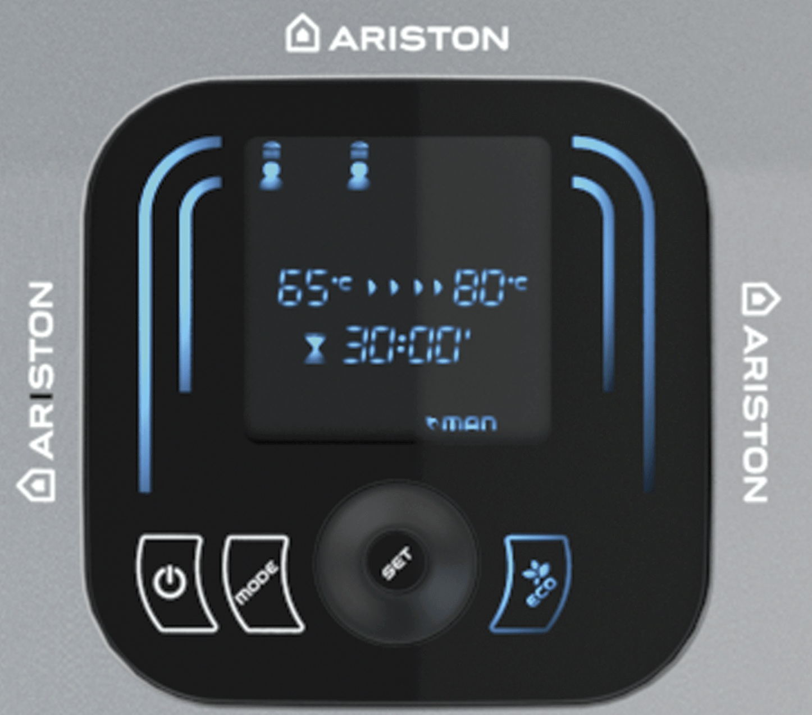
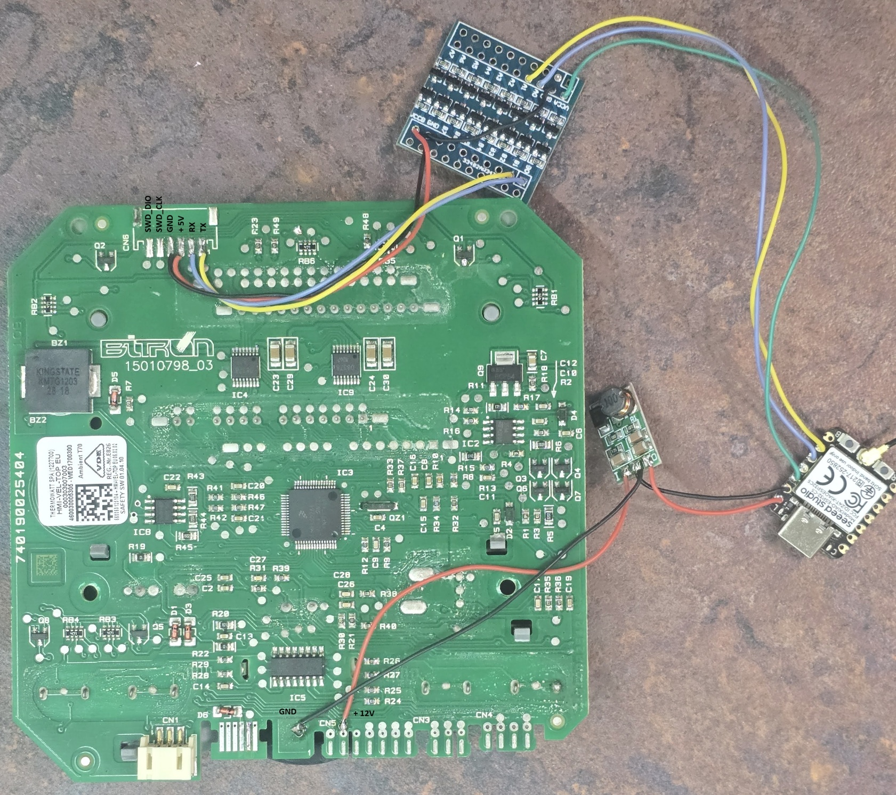

# ariston-esp32

This project controls an **Ariston Velis Evo Plus 100 EU** (VLS EVO PLUS 100 EU) water heater with an ESP32 and ESPHome.

## The connector: CN6

CN6 is an unpopulated 6-pin connector at the top of the control board (HMI-VEL-TOP EU, MCU NXP MKE02Z64VLH4). The pins are counted from the right in the picture below:

| CN6 pin | Signal | Goes to |
|---|---|---|
| 1 | TX of the heater board (UART1, 9600 baud, 5 V logic) | ESP RX |
| 2 | RX of the heater board | ESP TX |
| 3 | +5V | level shifter VCCB |
| 4 | GND | GND |
| 5 | SWD_CLK | not used |
| 6 | SWD_DIO | not used |

Pins 5 and 6 were traced with a multimeter to the MCU's SWD pins; they were not used.

## How I did it

- I used an ESP32-C5 (Seeed XIAO ESP32-C5).
- I used a level shifter, because the heater's RX/TX are at 5 V logic level.
  - Heater side (TX, RX, +5V and GND from CN6) connected to the B side.
  - ESP side connected to the A side: D8 = ESP RX (from CN6 pin 1), D9 = ESP TX (to CN6 pin 2), and the XIAO's 3V3 to VCCA.
  - On these level shifter modules the A side must be the lower voltage (VCCA ≤ VCCB).
- I used a 12 V → 5 V converter to power the ESP (into the XIAO's 5V pin). The 12 V comes from CN5 on the control board (the +12V and GND points marked in `circuit.jpg`).

**WARNING:** the 5 V on CN6 pin 3 comes from a 78L05A (on the front side of the board), which can supply only 100 mA and cannot power the ESP. Powering the XIAO directly on its 3V3 pin from a 12 V → 3.3 V converter did not work either; this may be a quirk of the Seeed XIAO ESP32-C5 board rather than of the heater.

## ESPHome

`ariston-esp32.yaml` needs the usual `wifi_ssid`, `wifi_password` and `api_key` in `secrets.yaml`. It reads everything every 60 s and gives Home Assistant:

| Entity | Type | Read | Write |
|---|---|---|---|
| Power | switch | yes | yes |
| ECO | switch | yes | yes |
| Anti-legionella | switch | yes | yes |
| Set temperature | number | yes | yes |
| Mode (MAN / P1 / P2 / P1+P2) | select | yes | yes |
| Clock | text sensor | yes | synced automatically from Home Assistant |
| Displayed temperature | sensor | yes | - |
| Average temperature; Right/Left tank bottom/top | sensors | yes | - |
| Time to set temperature | sensor (min) | yes | - |
| Heating, Anti-legionella cycle running | binary sensors | yes | - |

The clock is written into the heater after Home Assistant connects (at least 10 s after the ESP boots), whenever the heater reports it as not set (e.g. after a power cut), and whenever it is more than 3 minutes off.

## Not supported

Anti-calc, beep, the P1/P2 times and temperatures, and the number of available "showers" cannot be read or changed over this port (switching between MAN/P1/P2/P1+P2 works). See [DEBUG.md](DEBUG.md) for what was tried.

Anti-bacteria, anti-calc, beep and the maximum temperature can be set by long-pressing the **MODE** button (3 s). In that menu:

1. Anti-bacteria (bact)
2. Anti-calc (calc)
3. Beep
4. Maximum temperature (TSAF)

## Debugging and protocol

The protocol, the register map, the debug tools and everything I tested are in [DEBUG.md](DEBUG.md).

## Credits

The protocol was decoded on the Ariston Velis Wi-Fi by the people in this elektroda.com thread: https://www.elektroda.com/rtvforum/topic4148462.html
